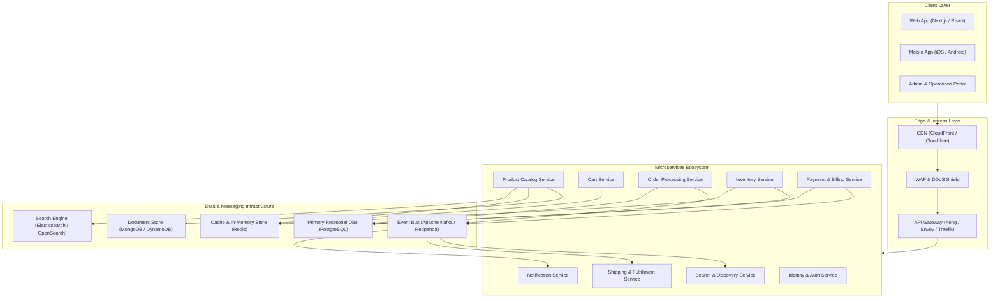
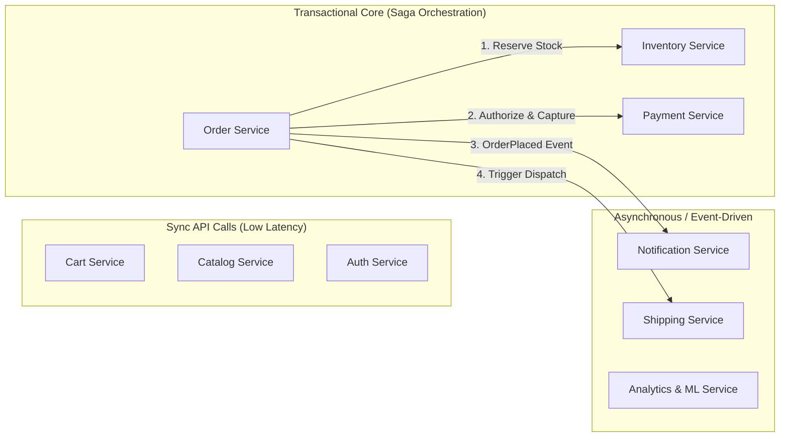
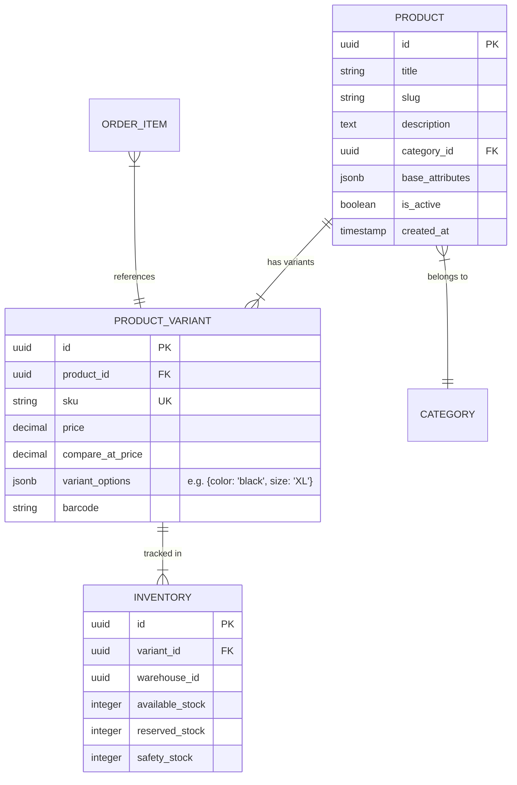
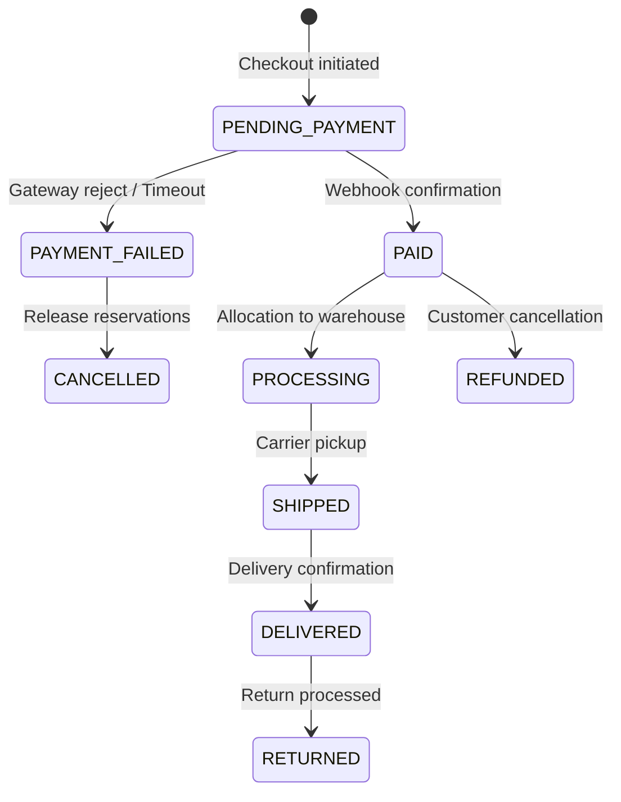
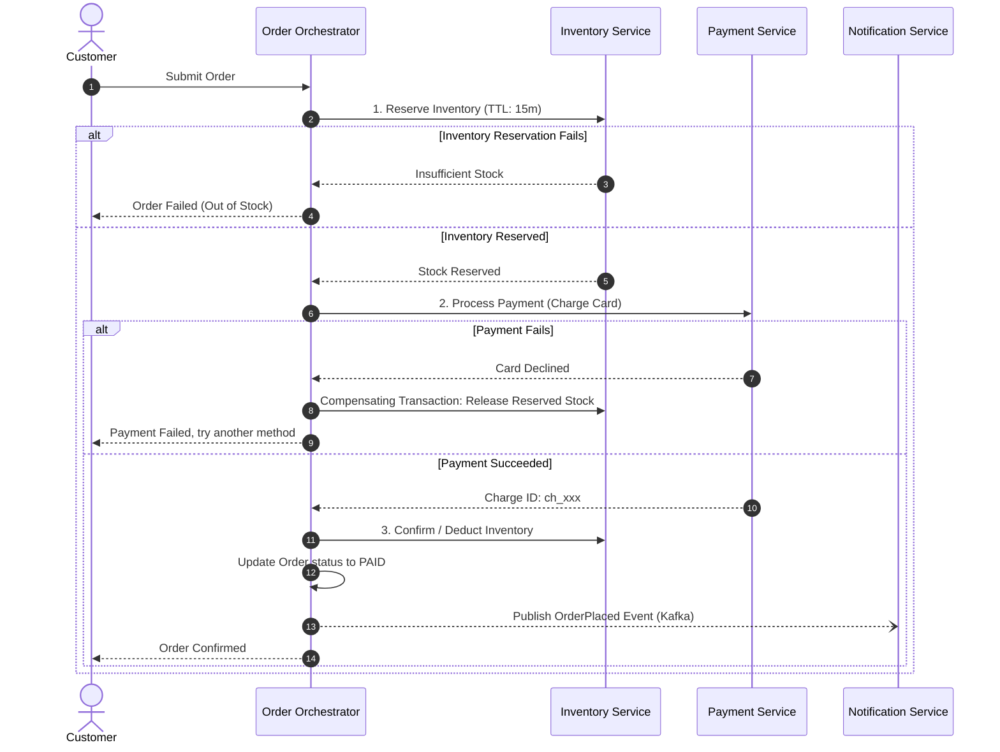

# E-Commerce Platform: Comprehensive Architecture & Design Specification

This document outlines the architecture, microservices decomposition, core components, data structures, and database models required to build a scalable, resilient, high-concurrency e-commerce application.

---

## 1. High-Level System Architecture

An e-commerce system must balance high-read traffic (browsing, catalog, searching) with strictly consistent transactional traffic (checkout, inventory reservation, payments).



---

## 2. Core Components

| Component | Responsibility | Recommended Technologies |
| :--- | :--- | :--- |
| **API Gateway** | Request routing, SSL termination, rate limiting, authentication verification, API versioning | Kong, Envoy, Traefik, AWS API Gateway |
| **Service Mesh / RPC** | Inter-service communication, mTLS, tracing, circuit breaking | gRPC + Protocol Buffers, Istio / Linkerd |
| **Event Broker** | Asynchronous decoupling, event sourcing, transactional outbox consumer | Apache Kafka, Redpanda, RabbitMQ |
| **Distributed Cache** | Session storage, cart storage, rate limiting windows, hot product caching | Redis Cluster, AWS ElastiCache |
| **Search Engine** | Full-text search, fuzzy search, faceted navigation (filters by price, brand, rating) | Elasticsearch, OpenSearch, Meilisearch |
| **Media / Asset Store** | Image processing, storage, video streaming for product showcases | Cloudflare Images, AWS S3 + CloudFront |

---

## 3. Microservices Breakdown & Domain Boundaries



### 1. Identity & Auth Service
- **Responsibilities**: Registration, OAuth2 / OIDC, JWT issuing & verification, Multi-Factor Auth (MFA), role-based access control (Customers, Merchandisers, Support, Admins).
- **Data Store**: PostgreSQL (ACID for credentials, security logs).

### 2. Product Catalog Service
- **Responsibilities**: Managing hierarchical categories, brands, products, SKU variants (size, color, material), attributes, media links.
- **Data Store**: MongoDB / PostgreSQL (JSONB) + Read-through Redis Cache.
- **Read Pattern**: Read-heavy (~95% reads). High cache hit ratios are critical.

### 3. Search & Discovery Service
- **Responsibilities**: Full-text search, spelling correction, auto-complete suggestions, faceted filtering, relevance ranking.
- **Data Store**: Elasticsearch / OpenSearch (populated via Kafka Change-Data-Capture / Debezium from Catalog Service).

### 4. Cart Service
- **Responsibilities**: Add/remove items, update quantities, coupon preview, guest-to-authenticated user cart merge upon login.
- **Data Store**: Redis (primary for speed and automatic TTL expiration) with write-behind persistence to PostgreSQL or DynamoDB.

### 5. Inventory Service
- **Responsibilities**: Warehouse stock tracking, SKU allocation, real-time availability checks, and temporary checkout reservations.
- **Data Store**: PostgreSQL (ACID transactions with Optimistic Concurrency Control and reservation status) + Redis read cache.

> [!IMPORTANT]
> **Overselling Prevention**: Stock reservation must be strictly atomic. Use two-phase stock locking:
> 1. **Soft Reserve**: Held for 10–15 minutes during checkout (using TTL in Redis or reservation rows in Postgres).
> 2. **Hard Commit**: Executed once payment confirms.
> 3. **Release**: Rolled back if payment fails or TTL expires.

### 6. Order Service
- **Responsibilities**: Order placement, checkout coordinator (Saga orchestrator), order state machine, invoice generation, cancellation & refunds.
- **Data Store**: PostgreSQL (strong consistency, relational integrity for financial correctness).

### 7. Payment Service
- **Responsibilities**: Payment gateway integration (Stripe, PayPal, Adyen, Razorpay), idempotency management, webhook handling, refund processing, PCI-DSS compliance isolation.
- **Data Store**: PostgreSQL (immutable audit ledger for all transaction attempts).

### 8. Shipping & Fulfillment Service
- **Responsibilities**: Shipping rate calculation, warehouse dispatching, carrier integrations (FedEx, UPS, DHL), tracking milestone updates.
- **Data Store**: PostgreSQL / Event Sourced.

### 9. Notification Service
- **Responsibilities**: Transactional emails, SMS alerts, push notifications, templating engine.
- **Trigger**: Consumes events from Kafka (`OrderPlaced`, `PaymentFailed`, `OrderShipped`).

---

## 4. Key Data Structures & In-Memory Patterns

Data structures play a pivotal role in e-commerce performance. Below are the optimal data structures mapped to specific functional requirements:

### A. Cart Storage (Redis Hashes)
- **Data Structure**: `Redis Hash` (`HSET`, `HGET`, `HDEL`, `HINCRBY`)
- **Key Pattern**: `cart:{userId}` or `cart:anon:{sessionToken}`
- **Structure**:
  ```redis
  HSET cart:usr_9812 sku_1001 2
  HSET cart:usr_9812 sku_1002 1
  EXPIRE cart:usr_9812 604800   # 7-day TTL
  ```
- **Rationale**: Constant-time O(1) item additions, updates, and removals without deserializing entire JSON payloads.

### B. Transactional Inventory Reservation (Optimistic Concurrency Control)
- **Data Structure**: Relational row with Version Column / Reservation Ledger
- **SQL Implementation**:
  ```sql
  -- Optimistic Locking for Stock Deduction
  UPDATE inventory
  SET available_stock = available_stock - :qty,
      reserved_stock = reserved_stock + :qty,
      version = version + 1
  WHERE variant_id = :variantId
    AND available_stock >= :qty
    AND version = :version;
  ```
- **Rationale**: Avoids database-level blocking deadlocks and eliminates unnecessary distributed Lua script complexity. If the affected row count is 0, the application knows stock was concurrently updated or depleted and gracefully prompts the user.

### C. Search Auto-complete & Typeahead
- **Data Structure**: **Trie (Prefix Tree)** or **Radix Tree**
- **Structure**:
  ```
          (root)
         /      \
        s        p
       /          \
      h            h
     / \            \
    o   i            o
   /     \            \
  e(12k)  r            n
           \            \
            t(8k)        e(45k)
  ```
- **Alternative**: Redis Sorted Sets (`ZADD` with prefix scoring) or Elasticsearch Completion Suggester.
- **Rationale**: O(K) lookup time where K is query length, enabling sub-millisecond suggestions as the user types.

### D. Rate Limiting (Sliding Window Log)
- **Data Structure**: **Redis Sorted Set (ZSET)**
- **Key Pattern**: `ratelimit:{ip}:{endpoint}`
- **Operation**:
  - `ZADD key <currentTimeMs> <uniqueRequestId>`
  - `ZREMRANGEBYSCORE key 0 <currentTimeMs - windowSizeMs>`
  - `ZCARD key` -> verify if count exceeds limit.
- **Rationale**: Provides smooth rate limiting without boundary-reset vulnerabilities found in fixed-window algorithms.

### E. Category Hierarchy & Breadcrumbs
- **Data Structure**: **Adjacency List with Materialized Path** or **Closure Table**
- **Database Model**:
  ```sql
  CREATE TABLE categories (
      id UUID PRIMARY KEY,
      name VARCHAR(100) NOT NULL,
      slug VARCHAR(100) UNIQUE NOT NULL,
      parent_id UUID REFERENCES categories(id),
      path VARCHAR(255) NOT NULL -- e.g. "/electronics/computers/laptops"
  );
  CREATE INDEX idx_categories_path ON categories (path text_pattern_ops);
  ```
- **Rationale**: Fetching an entire subtree (e.g. all products under `electronics`) is a single indexed prefix query: `WHERE path LIKE '/electronics/%'`.

---

## 5. Relational Schemas & Core Data Models (PostgreSQL)

### A. Product & SKU Variant Model
Supports polymorphic attributes (e.g. Shoes have "Size: 10", Shirts have "Fit: Slim").



### B. Order & Finite State Machine (FSM)



#### Order Entity Schema:
```sql
CREATE TABLE orders (
    id UUID PRIMARY KEY DEFAULT gen_random_uuid(),
    order_number VARCHAR(32) UNIQUE NOT NULL,
    user_id UUID NOT NULL,
    status VARCHAR(32) NOT NULL DEFAULT 'PENDING_PAYMENT',
    currency VARCHAR(3) NOT NULL DEFAULT 'USD',
    subtotal_amount NUMERIC(12, 2) NOT NULL,
    tax_amount NUMERIC(12, 2) NOT NULL DEFAULT 0.00,
    shipping_amount NUMERIC(12, 2) NOT NULL DEFAULT 0.00,
    total_amount NUMERIC(12, 2) NOT NULL,
    shipping_address JSONB NOT NULL,
    billing_address JSONB NOT NULL,
    idempotency_key VARCHAR(64) UNIQUE,
    created_at TIMESTAMPTZ NOT NULL DEFAULT NOW(),
    updated_at TIMESTAMPTZ NOT NULL DEFAULT NOW()
);

CREATE TABLE order_items (
    id UUID PRIMARY KEY DEFAULT gen_random_uuid(),
    order_id UUID NOT NULL REFERENCES orders(id) ON DELETE CASCADE,
    variant_id UUID NOT NULL,
    sku VARCHAR(64) NOT NULL,
    product_title VARCHAR(255) NOT NULL,
    unit_price NUMERIC(12, 2) NOT NULL,
    quantity INTEGER NOT NULL CHECK (quantity > 0),
    total_price NUMERIC(12, 2) NOT NULL
);
```

---

## 6. Critical Distributed System Patterns

### 1. Distributed Transactions (Saga Orchestrator Pattern)
To maintain consistency across microservices without 2-Phase Commit (2PC):



### 2. Transactional Outbox Pattern
Avoids the **dual-write problem** (updating the database and sending a message to Kafka at the same time).
- Orders and messages are written into the same local DB transaction:
  ```sql
  BEGIN;
  INSERT INTO orders (...) VALUES (...);
  INSERT INTO outbox_events (aggregate_type, aggregate_id, type, payload)
  VALUES ('ORDER', order_id, 'ORDER_CREATED', '{"order_id": "...", "amount": 100}');
  COMMIT;
  ```
- A background worker (Debezium or Change-Data-Capture / Polling Worker) reads `outbox_events` and reliably streams them to Kafka.

### 3. Idempotency Keys
- Prevents duplicate charges if the user double-clicks the "Pay" button or network drops.
- Frontend generates a UUID `Idempotency-Key` sent in HTTP headers.
- Payment Service checks Redis/Postgres for the key:
  - If processing: return `409 Conflict` or wait.
  - If already completed: return cached response immediately without re-charging.

---

## 7. Recommended Technology Stack Matrix

| Layer | Recommended Choice | Viable Alternative |
| :--- | :--- | :--- |
| **Frontend Web** | Next.js (SSR/SSG for SEO, React 19) | Remix, Nuxt.js |
| **Mobile** | React Native / Flutter | Swift / Kotlin Native |
| **Backend Services** | Node.js (TypeScript) / Go / Java Spring Boot | Python (FastAPI) |
| **Primary Relational DB** | PostgreSQL 16+ | MySQL 8.4 / AWS Aurora |
| **NoSQL / Flexible Catalog** | MongoDB / AWS DynamoDB | Couchbase |
| **Cache & Queue In-Memory** | Redis 7+ (Cluster) | DragonflyDB / KeyDB |
| **Event Streaming** | Apache Kafka / Redpanda | RabbitMQ / AWS SQS+SNS |
| **Search Engine** | Elasticsearch / OpenSearch | Meilisearch / Algolia |
| **Observability & Tracing** | OpenTelemetry + Prometheus + Grafana | Datadog / New Relic |

---

## 8. Detailed Service & Feature Specifications

For in-depth service architectures, database migrations, and API schemas:
- [Search Service & Kafka CDC Pipeline Architecture](file:///Users/msp/DC/Projects/e-commerce/docs/search_service_arch.md)
- [User Profile & Cart Service Architecture](file:///Users/msp/DC/Projects/e-commerce/docs/profile_and_cart_arch.md)
- [Identity & Auth Service Architecture](file:///Users/msp/DC/Projects/e-commerce/docs/auth_service_arch.md)
- [Product Catalog Service Architecture](file:///Users/msp/DC/Projects/e-commerce/docs/product_service_plan.md)
- [Frontend Architecture Plan](file:///Users/msp/DC/Projects/e-commerce/docs/frontend_plan.md)
- [Endpoint API Specifications Directory](file:///Users/msp/DC/Projects/e-commerce/docs/APIs)

