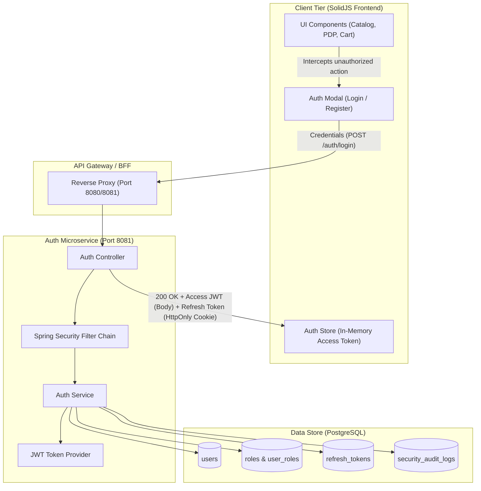
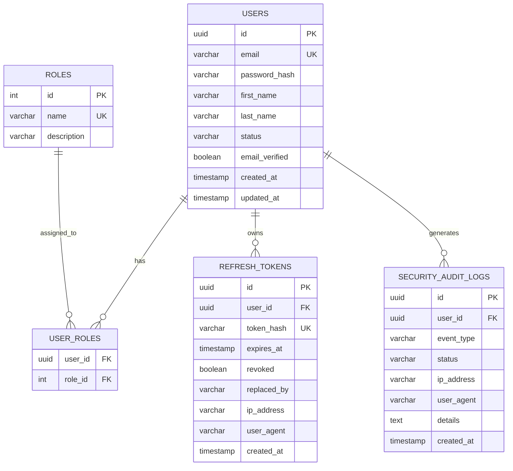

# Identity & Auth Service Architecture Specification

- **Service Name**: `auth-service`
- **Port**: `8081`
- **Data Store**: PostgreSQL (ACID compliant for credentials, sessions, and security audit logs)
- **Framework**: Spring Boot 3.3.4 / Java 17 / Spring Security 6
- **Primary Responsibilities**: User registration, credential authentication, JWT token issuing & verification, refresh token rotation, role-based access control (RBAC), and security audit logging.

---

## 1. System Overview & Token Lifecycle

### 1.1 High-Level Architecture



### 1.2 Dual-Token Architecture

To combine strong protection against Cross-Site Scripting (XSS) with defenses against Cross-Site Request Forgery (CSRF):

1. **Access Token (Short-Lived JWT - 15 Minutes)**:
   - Transmitted in HTTP response body upon login/refresh.
   - Held **exclusively in-memory** in the SolidJS application state (`authStore.ts`).
   - Attached to API requests via the `Authorization: Bearer <token>` header.
   - Even if an attacker executes malicious JavaScript (XSS), the access token is ephemeral and cannot be extracted from browser persistent storage (localStorage/sessionStorage).
   - Contains claims: `sub` (User ID), `email`, `roles`, `iat`, `exp`, `iss` (`aura-auth-service`).

2. **Refresh Token (Long-Lived Opaque Token - 7 Days)**:
   - Stored in an **`HttpOnly; Secure; SameSite=Strict; Path=/api/v1/auth`** cookie.
   - Inaccessible to client JavaScript, preventing theft via XSS.
   - Stored in PostgreSQL in SHA-256 hashed form (`token_hash`) for zero-knowledge storage.
   - Single-use with **Automatic Token Rotation (RTR)**: Every time a refresh token is used, it is invalidated and replaced by a newly issued refresh token.
   - **Reuse Detection**: If a revoked refresh token is presented, all descendant tokens in the session family are revoked immediately as a compromised session indicator.

---

## 2. PostgreSQL Database Schema



### 2.1 SQL Schema DDL (`V1__init_auth_schema.sql`)

```sql
-- Extensions
CREATE EXTENSION IF NOT EXISTS "uuid-ossp";

-- 1. Roles table
CREATE TABLE IF NOT EXISTS roles (
    id SERIAL PRIMARY KEY,
    name VARCHAR(32) NOT NULL UNIQUE,
    description VARCHAR(255)
);

INSERT INTO roles (name, description) VALUES
    ('ROLE_CUSTOMER', 'Standard shopper with cart, wishlist, and checkout permissions'),
    ('ROLE_MERCHANDISER', 'Manages catalog, inventory categories, and promotions'),
    ('ROLE_SUPPORT', 'Customer support agent with order lookup and refund capabilities'),
    ('ROLE_ADMIN', 'Platform super-administrator with full system access')
ON CONFLICT (name) DO NOTHING;

-- 2. Users table
CREATE TABLE IF NOT EXISTS users (
    id UUID PRIMARY KEY DEFAULT uuid_generate_v4(),
    email VARCHAR(255) NOT NULL UNIQUE,
    password_hash VARCHAR(255) NOT NULL,
    first_name VARCHAR(100) NOT NULL,
    last_name VARCHAR(100) NOT NULL,
    status VARCHAR(32) NOT NULL DEFAULT 'ACTIVE',
    email_verified BOOLEAN NOT NULL DEFAULT FALSE,
    created_at TIMESTAMP WITH TIME ZONE NOT NULL DEFAULT CURRENT_TIMESTAMP,
    updated_at TIMESTAMP WITH TIME ZONE NOT NULL DEFAULT CURRENT_TIMESTAMP
);

CREATE INDEX IF NOT EXISTS idx_users_email ON users(email);
CREATE INDEX IF NOT EXISTS idx_users_status ON users(status);

-- 3. User-Roles join table
CREATE TABLE IF NOT EXISTS user_roles (
    user_id UUID NOT NULL REFERENCES users(id) ON DELETE CASCADE,
    role_id INT NOT NULL REFERENCES roles(id) ON DELETE CASCADE,
    PRIMARY KEY (user_id, role_id)
);

CREATE INDEX IF NOT EXISTS idx_user_roles_user ON user_roles(user_id);

-- 4. Refresh Tokens table (hashed for security, rotation tracking)
CREATE TABLE IF NOT EXISTS refresh_tokens (
    id UUID PRIMARY KEY DEFAULT uuid_generate_v4(),
    user_id UUID NOT NULL REFERENCES users(id) ON DELETE CASCADE,
    token_hash VARCHAR(64) NOT NULL UNIQUE,
    expires_at TIMESTAMP WITH TIME ZONE NOT NULL,
    revoked BOOLEAN NOT NULL DEFAULT FALSE,
    replaced_by VARCHAR(64),
    ip_address VARCHAR(45),
    user_agent VARCHAR(512),
    created_at TIMESTAMP WITH TIME ZONE NOT NULL DEFAULT CURRENT_TIMESTAMP
);

CREATE INDEX IF NOT EXISTS idx_refresh_tokens_user ON refresh_tokens(user_id);
CREATE INDEX IF NOT EXISTS idx_refresh_tokens_hash ON refresh_tokens(token_hash);
CREATE INDEX IF NOT EXISTS idx_refresh_tokens_expires ON refresh_tokens(expires_at);

-- 5. Security Audit Logs table
CREATE TABLE IF NOT EXISTS security_audit_logs (
    id UUID PRIMARY KEY DEFAULT uuid_generate_v4(),
    user_id UUID REFERENCES users(id) ON DELETE SET NULL,
    event_type VARCHAR(64) NOT NULL,
    status VARCHAR(32) NOT NULL,
    ip_address VARCHAR(45),
    user_agent VARCHAR(512),
    details TEXT,
    created_at TIMESTAMP WITH TIME ZONE NOT NULL DEFAULT CURRENT_TIMESTAMP
);

CREATE INDEX IF NOT EXISTS idx_audit_user_id ON security_audit_logs(user_id);
CREATE INDEX IF NOT EXISTS idx_audit_event_type ON security_audit_logs(event_type);
CREATE INDEX IF NOT EXISTS idx_audit_created_at ON security_audit_logs(created_at);
```

---

## 3. Role-Based Access Control (RBAC) Matrix

| Endpoint / Action | Public / Guest | Customer | Merchandiser | Support | Admin |
| :--- | :---: | :---: | :---: | :---: | :---: |
| Browse Catalog & Read Details |  |  |  |  |  |
| Add to Cart / Wishlist / Buy Now | ❌ *(Intercepted)* |  |  |  |  |
| View Order History / Profile | ❌ |  |  |  |  |
| Create / Update Products & Catalog | ❌ | ❌ |  | ❌ |  |
| Process Cancellations / Refunds | ❌ | ❌ | ❌ |  |  |
| User & Role Management | ❌ | ❌ | ❌ | ❌ |  |
| View Security Audit Logs | ❌ | ❌ | ❌ | ❌ |  |

---

## 4. Security Mitigations

1. **Password Hashing**: BCrypt with strength factor 12.
2. **Brute Force Protection**: Account lockout after 5 consecutive failed attempts within a 15-minute rolling window.
3. **Audit Trails**: All registration, login success/failure, refresh rotation, and logout events recorded in `security_audit_logs`.
4. **CORS Configuration**: Allowed origins restricted to trusted frontend domain (`http://localhost:5173` in local development) with `allowCredentials=true`.

---

## 5. Extensibility Roadmap

1. **Multi-Factor Auth (MFA)**:
   - RFC 6238 TOTP with QR Code provisioning via `otpauth://totp/...`.
   - Single-use hashed backup codes.
   - Mandatory for `ROLE_ADMIN`, `ROLE_MERCHANDISER`, and `ROLE_SUPPORT`.
2. **OAuth2 / OIDC Federated Login**:
   - Google & GitHub identity provider redirect and code-exchange flow.
   - Automatic account linking via verified email address.
