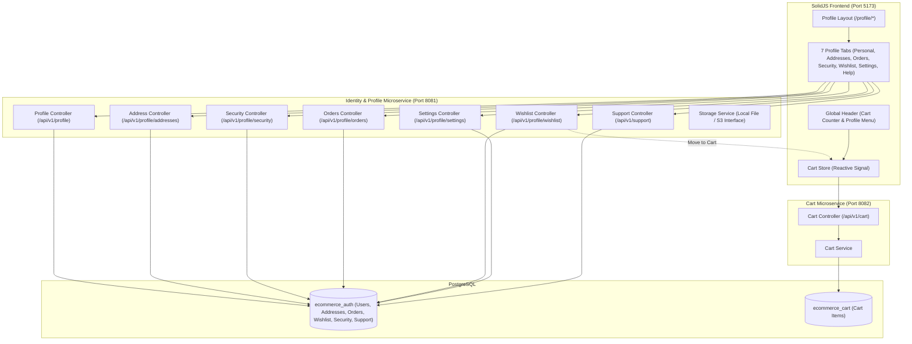

# User Profile & Cart Service Architecture Specification

This document details the architecture, service boundaries, data schemas, API contracts, and frontend integration for the **User Profile Module** and the dedicated **Cart Microservice** in the AuraCommerce platform.

---

## 1. System Architecture & Boundaries



---

## 2. Dedicated Cart Service (`cart-service` - Port 8082)

### 2.1 Database Schema
```sql
CREATE TABLE cart_items (
    id UUID PRIMARY KEY DEFAULT gen_random_uuid(),
    user_id UUID NOT NULL,
    product_id UUID NOT NULL,
    sku VARCHAR(64) NOT NULL,
    title VARCHAR(255) NOT NULL,
    price NUMERIC(12, 2) NOT NULL,
    quantity INTEGER NOT NULL CHECK (quantity > 0),
    image_url VARCHAR(512),
    created_at TIMESTAMPTZ NOT NULL DEFAULT NOW(),
    updated_at TIMESTAMPTZ NOT NULL DEFAULT NOW(),
    CONSTRAINT uq_cart_user_sku UNIQUE (user_id, sku)
);
CREATE INDEX idx_cart_items_user ON cart_items(user_id);
```

### 2.2 API Endpoints
- `GET /api/v1/cart` - Get user's cart items and total breakdown.
- `POST /api/v1/cart/items` - Add item to cart or increment quantity.
- `PUT /api/v1/cart/items/{itemId}` - Update item quantity.
- `DELETE /api/v1/cart/items/{itemId}` - Remove item from cart.
- `DELETE /api/v1/cart` - Clear entire cart.

---

## 3. User Profile Schemas in `auth-service` (Port 8081)

### 3.1 Migration Summary
- **Users Table Extensions**: `phone_number`, `phone_verified`, `dob`, `gender`, `avatar_url`, `two_factor_enabled`, `two_factor_secret`, `two_factor_backup_codes`, `scheduled_purge_at`, `deletion_requested_at`.
- **`user_addresses` Table**: Full address fields, `is_default_shipping`, `is_default_billing`, `deleted` boolean for soft-deletion.
- **`user_verifications` Table**: Verification tokens and 6-digit OTPs for email and phone changes with expiration windows.
- **`user_settings` Table**: Category notification toggles (email, SMS, push), language, currency, and privacy consents.
- **`wishlist_items` Table**: Saved products with price, SKU, availability, and user scoping.
- **`orders` & `order_items` Tables**: Full order lifecycle states (`PLACED`, `CONFIRMED`, `PROCESSING`, `SHIPPED`, `DELIVERED`, `CANCELLED`, `RETURN_REQUESTED`, `RETURNED`), shipping address snapshot, tracking details.
- **`order_status_history` & `return_requests` Tables**: Multi-step fulfillment timeline and return initiation processing.
- **`support_faqs` & `support_tickets` Tables**: FAQ knowledge base and support ticket history with threaded messages and attachments.

### 3.2 2FA TOTP Implementation (Native RFC 6238)
Implemented via Java standard library (`javax.crypto.Mac` HmacSHA1):
1. **Secret Generation**: Cryptographically secure 20-byte random seed encoded as Base32.
2. **Key URI**: Formatted as `otpauth://totp/AuraCommerce:<email>?secret=<secret>&issuer=AuraCommerce`.
3. **Time-Step Verification**: 30-second intervals with ±1 step drift tolerance.
4. **Backup Codes**: 8 single-use alphanumeric backup tokens generated and stored hashed.

### 3.3 Storage Adapter Pattern (`StorageService`)
- Interface `StorageService` provides `upload(MultipartFile, String subfolder)` and `delete(String fileUrl)`.
- `LocalStorageServiceImpl` saves to `./uploads/` and serves files through Spring WebMvc static resource handler `/uploads/**`.

---

## 4. Frontend Profile Navigation & Shell

- Route structure: `/profile` (Shell) with child routes:
  - `/profile/personal` - Profile info, avatar crop/upload, email & phone OTP modals.
  - `/profile/addresses` - Address grid, default badges, add/edit modal, soft-delete confirmation.
  - `/profile/orders` - Order history list, status badges, tracking timeline modal, cancel & return actions.
  - `/profile/security` - Password change with strength meter, active sessions list with revoke, 2FA setup wizard.
  - `/profile/wishlist` - Product cards, stock status, "Move to Cart" button linked to `cartStore`.
  - `/profile/settings` - Preferences toggles, Account deletion with typed `"DELETE"` confirmation and 30-day grace period notice.
  - `/profile/help` - FAQ accordion, support ticket creation with order prefill, ticket status history.
