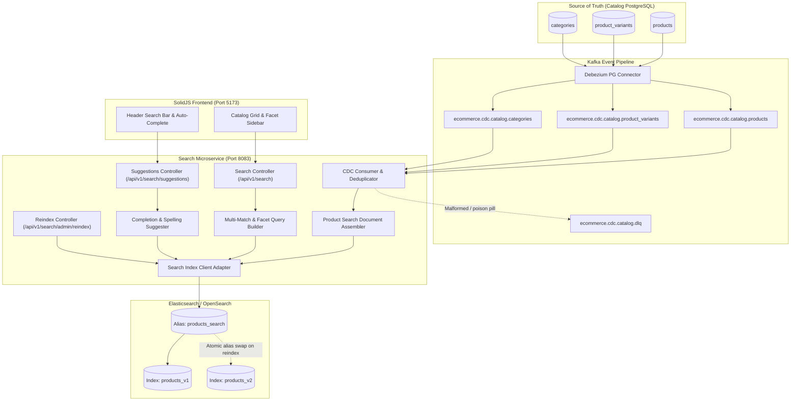
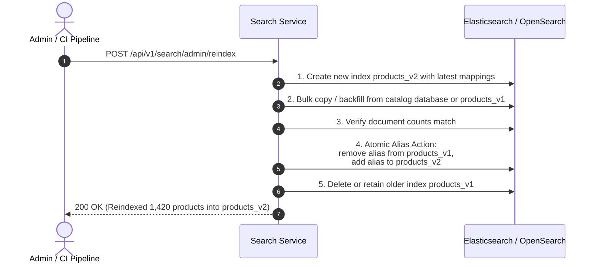

# Search Service & Kafka CDC Pipeline Architecture Specification

- **Service Name**: `search-service`
- **Port**: `8083`
- **Search Engine**: Elasticsearch / OpenSearch 8+ (Index alias: `products_search`)
- **Event Streaming**: Apache Kafka (Debezium Change-Data-Capture)
- **Framework**: Spring Boot 3.3.4 / Java 17 / Spring Kafka
- **Primary Responsibilities**: Ingesting catalog CDC events from Kafka, near-real-time indexing, multi-field boosted full-text search, spelling correction ("did you mean"), auto-complete suggestions, faceted filtering, and zero-downtime reindexing.

---

## 1. System Architecture & Ingestion Flow



---

## 2. Kafka Topic & CDC Event Specifications

### 2.1 Topic Naming Conventions
- `ecommerce.cdc.catalog.products`: Captures table mutations from `products`.
- `ecommerce.cdc.catalog.product_variants`: Captures variant and price/stock changes.
- `ecommerce.cdc.catalog.categories`: Captures category hierarchy and naming changes.
- `ecommerce.cdc.catalog.dlq`: Dead-letter queue for unparseable or poisoned messages.

### 2.2 Debezium Envelope Format
```json
{
  "op": "u",
  "ts_ms": 1726320000000,
  "before": {
    "id": "c1f76d20-8e10-48e2-9b2f-4a0b271e8c91",
    "title": "Old Keyboard Title",
    "updated_at": "2026-09-14T09:00:00Z"
  },
  "after": {
    "id": "c1f76d20-8e10-48e2-9b2f-4a0b271e8c91",
    "title": "Ergonomic Bamboo Wireless Mechanical Keyboard",
    "slug": "ergonomic-bamboo-wireless-mechanical-keyboard",
    "short_description": "Dual-mode Bluetooth 5.2 mechanical keyboard.",
    "description": "Handcrafted with natural solid bamboo...",
    "category_id": "e83e5891-b14a-4d7a-b5ea-16e0339d2c12",
    "is_active": true,
    "average_rating": 4.85,
    "review_count": 142,
    "updated_at": "2026-09-14T10:00:00Z"
  }
}
```

### 2.3 Idempotency & Out-of-Order Handling
1. **Timestamp Check**: Every document in Elasticsearch records `updatedAt` / `version`. If an incoming CDC event has `ts_ms` or `updated_at` older than the document currently indexed, the update is safely ignored.
2. **Operations Supported**:
   - `c` (Create) / `r` (Snapshot Read) -> Upsert document.
   - `u` (Update) -> Partial or full document update.
   - `d` (Delete) -> Remove document from index or mark `isActive: false`.

---

## 3. Elasticsearch Index Mapping & Settings

### 3.1 Settings & Analyzers
```json
{
  "settings": {
    "number_of_shards": 2,
    "number_of_replicas": 1,
    "refresh_interval": "1s",
    "analysis": {
      "analyzer": {
        "search_autocomplete_analyzer": {
          "type": "custom",
          "tokenizer": "standard",
          "filter": ["lowercase", "autocomplete_filter"]
        },
        "search_query_analyzer": {
          "type": "custom",
          "tokenizer": "standard",
          "filter": ["lowercase"]
        }
      },
      "filter": {
        "autocomplete_filter": {
          "type": "edge_ngram",
          "min_gram": 2,
          "max_gram": 15
        }
      }
    }
  }
}
```

### 3.2 Field Mapping (`products_v1`)
| Field Name | Type | Purpose / Capabilities |
| :--- | :--- | :--- |
| `id` | `keyword` | Document identifier (Product UUID) |
| `title` | `text` + `keyword` | Full-text search with autocomplete edge_ngram analyzer, boost `3.0` |
| `slug` | `keyword` | Exact URL slug reference |
| `brand` | `text` + `keyword` | Searchable with boost `2.0`, exact facet aggregation on `brand.keyword` |
| `categoryName` | `text` + `keyword` | Searchable with boost `1.5`, facet aggregation on `categoryName.keyword` |
| `categorySlug` | `keyword` | Filter parameter from URL/store |
| `shortDescription` | `text` | Full-text search with boost `1.2` |
| `description` | `text` | Full-text search with boost `1.0` |
| `price` | `scaled_float` | Filtering, range aggregations, and sorting (`scaling_factor: 100`) |
| `compareAtPrice` | `scaled_float` | Discount computation |
| `averageRating` | `half_float` | Range filtering and sorting |
| `reviewCount` | `integer` | Popularity boosting |
| `stockQuantity` | `integer` | Inventory tracking |
| `stockStatus` | `keyword` | Facet filtering (`IN_STOCK`, `LOW_STOCK`, `OUT_OF_STOCK`) |
| `thumbnailUrl` | `keyword` | Image display |
| `suggest` | `completion` | Dedicated fast completion suggester for auto-complete dropdown |
| `updatedAt` | `date` | CDC deduplication and freshness ranking |

---

## 4. Query Features & Relevance Scoring

### 4.1 Tunable Field Boosts
Relevance scoring uses a multi-match query across text fields with configurable weights:
- `title` weight: `3.0`
- `brand` weight: `2.0`
- `categoryName` weight: `1.5`
- `shortDescription` weight: `1.2`
- `description` weight: `1.0`
- `inStock` boost: `1.5` (products in stock rank higher than out-of-stock items)
- `rating` boost: Gaussian decay or linear boost for high review ratings

### 4.2 Spelling Correction ("Did you mean")
- Built-in phrase and term suggester on `title` and `brand`.
- If a query yields low or zero scores and a suggestion has high confidence, the API returns `didYouMean: "..."` and can auto-query alternatives.

### 4.3 Facet Aggregations
Standard faceted search aggregations:
- `categories`: Terms aggregation on `categoryName.keyword`
- `brands`: Terms aggregation on `brand.keyword`
- `price_ranges`: Range aggregation (`[0-5000]`, `[5000-15000]`, `[15000-30000]`, `[30000+]`)
- `ratings`: Range aggregation (`4.5+`, `4.0+`, `3.5+`)
- `stock_statuses`: Terms aggregation on `stockStatus`

---

## 5. Zero-Downtime Reindexing Architecture



---

## 6. REST API Endpoints

- `GET /api/v1/search`: Query search results with facets and "did you mean" suggestion.
- `GET /api/v1/search/suggestions`: Auto-complete dropdown returning products, categories, and brands.
- `POST /api/v1/search/admin/reindex`: Full reindex and alias swap.
